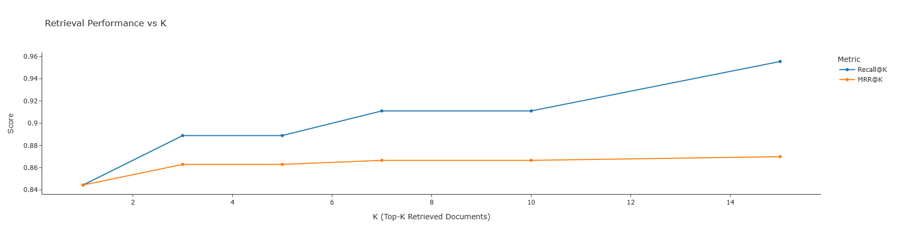
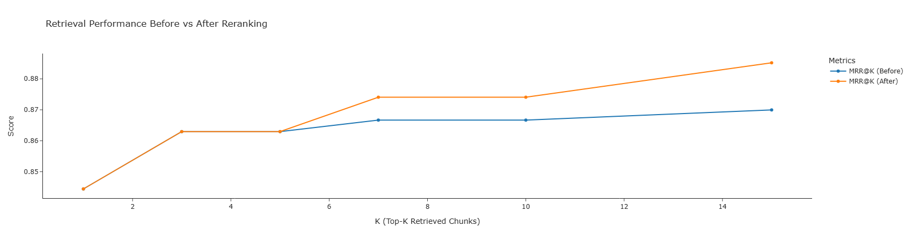
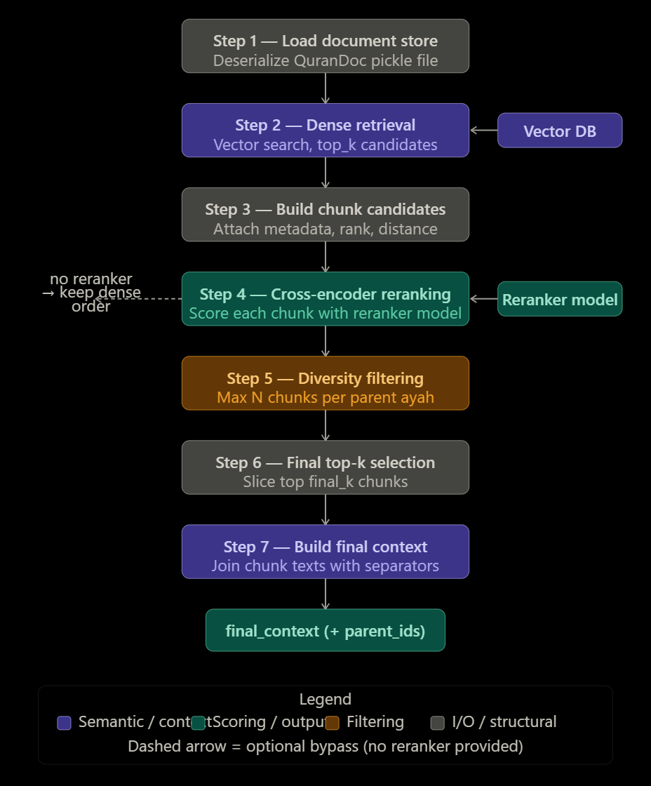
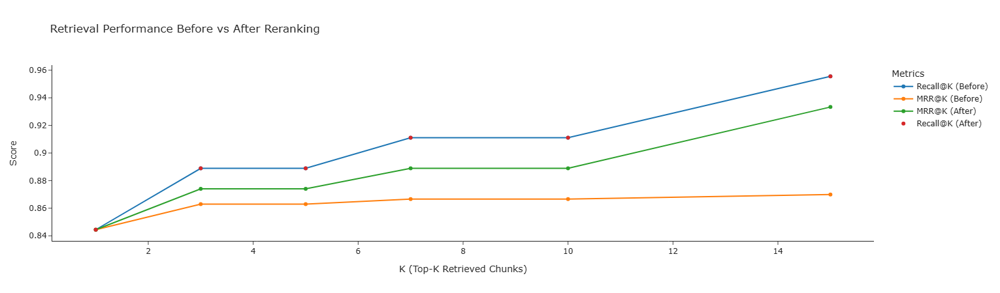

# Islamic-AI-Assistant

Islamic-AI-Assistant is a research-oriented multi-agent AI system designed to assist Muslims in understanding Islamic knowledge and organizing daily life activities using Retrieval-Augmented Generation (RAG), Large Language Models (LLMs), and semantic search techniques.

The project combines:

* Quran and Tafsir semantic retrieval
* RAG-based question answering
* Islamic knowledge grounding
* Multi-agent orchestration
* Planning and productivity assistance


# Current Agents

## Mufasir Agent

A Quran and Tafsir RAG-based assistant specialized in:

* Quran interpretation
* Classical tafsir understanding
* Semantic Quran retrieval
* Grounded question answering


## Fatwa Agent *(planned)*

An Islamic QA assistant intended to answer religious questions using:

* Quran
* Sunnah
* Classical scholarly references


## Planner Agent *(planned)*

A productivity assistant designed to:

* Generate weekly schedules
* Integrate prayer times
* Organize to-do lists
* Assist with habit management


# Research Objectives

This project explores several research directions in modern RAG systems:

* Semantic retrieval for Quranic texts
* Tafsir chunking strategies
* Retrieval evaluation metrics
* Hallucination reduction in Islamic QA systems
* Reranking pipelines for retrieval optimization
* Grounded generation with open-source LLMs


# Technology Stack

## Retrieval & Vector Database

* `ChromaDB`
* `BAAI/bge-m3` embeddings
* Semantic chunking pipeline

## LLM Inference

* `Ollama`
* `Mistral`
* `Qwen`
* Local open-source inference

## Backend & Frameworks

* `Python`
* `Poetry`
* `Pandas`
* `NumPy`


# Dataset

The project primarily uses the dataset:

* [gurgutan/quran-tafseer-qurancom](https://huggingface.co/datasets/gurgutan/quran-tafseer-qurancom?utm_source=chatgpt.com)

Citation:

```bibtex
@dataset{quran_tafsir,
  title = {QuranDataset: A Dataset of Quran Verses and Tafseer},
  url = {https://escape-team.tech/},
  author = {Slepovichev Ivan},
  email = {gurgutan@yandex.ru},
  month = {March},
  year = {2025}
}
```

Since the dataset contains missing tafsir entries for approximately `4341` ayahs, an additional dataset was integrated:

* [Quran Tafsir Ibn Kathir Dataset](https://www.kaggle.com/datasets/oyilmaztekin/quran-tafsir-ibn-kathir-jsonl?utm_source=chatgpt.com)


# Development Setup

The project uses [Poetry](https://python-poetry.org/docs/basic-usage/?utm_source=chatgpt.com) for dependency management and packaging.

## Installation

```bash
git clone <repository_url>

cd Islamic-AI-Assistant

poetry install
```

Activate environment:

```bash
poetry shell
```


# Mufasir Agent Architecture

## RAG Pipeline

The Mufasir agent follows a Retrieval-Augmented Generation pipeline:

```text
User Query
    ↓
Semantic Retrieval (ChromaDB)
    ↓
Top-K Tafsir Chunks
    ↓
Context Construction
    ↓
LLM Generation
    ↓
Grounded Quranic Answer
```


# Document Structure

The retrieval system is organized into three levels:

| Component      | Description                         |
| -------------- | ----------------------------------- |
| `QuranDoc`     | Full ayah + complete tafsir         |
| `QuranChunk`   | Semantic tafsir sub-sections        |
| `IndexedChunk` | Embedded chunks stored in vector DB |


# Chunking Strategy

The system performs:

* header-aware splitting
* semantic chunking
* token-length constrained segmentation

Embeddings are generated using:

```text
BAAI/bge-m3
```

and stored in ChromaDB for semantic retrieval.


# Retrieval Evaluation

The retrieval pipeline was evaluated on a benchmark subset composed of:

* 50 Quranic question-answer samples
* randomly indexed ayahs

Example evaluation sample:

| surah_n | ayah_n | question                                         |
| ------- | ------ | ------------------------------------------------ |
| 9       | 50     | What does the tafsir say grieves the hypocrites? |

Ground-truth answer:

> “When a blessing such as victory and triumph over enemies is given to the Prophet, it grieves the hypocrites.”


# Evaluation Metrics

The system currently evaluates retrieval quality using:

* Recall@K
* Mean Reciprocal Rank (MRR@K)

for:

```text
K ∈ {1, 3, 5, 7, 10, 15}
```


# Experimental Findings

The experiments reveal two important behaviors:

## Recall@K

Increasing `K` significantly improves retrieval recall, meaning the retriever is capable of finding the correct Quranic chunks within larger candidate sets.

## MRR@K

MRR improves more slowly, indicating that while relevant chunks are retrieved, they are often not ranked among the top positions.

This observation suggests that the current bottleneck is:

* ranking quality rather than retrieval coverage.


# Improvements

## Diversity-aware post-processing

Dense retrieval at the chunk level introduces a common issue of semantic clustering, where multiple top-ranked results originate from the same parent document. While this improves local relevance, it reduces the diversity of retrieved evidence.

We therefore apply a post-processing step that enforces parent-level uniqueness constraint, selecting at most one chunk per (surah, ayah) pair while preserving ranking order. This approach can be interpreted as a lightweight diversity enhancement strategy similar to Maximal Marginal Relevance (MMR), but applied at the document granularity level.

Empirically, this improves MRR by reducing rank saturation on repeated parent documents.




```code
vector_db.search("Allah's mercy")

{'ids': [['18:98:7', '18:98:5', '18:98:17', '18:98:1', '18:98:18']],
 'embeddings': None,
 'documents': [['Surah 18, Ayah 98\n\nArabic:\nقَالَ هَـٰذَا رَحْمَةٌ مِّن رَّبِّى ۖ فَإِذَا جَآءَ وَعْدُ رَبِّى جَعَلَهُۥ دَكَّآءَ ۖ وَكَانَ وَعْدُ رَبِّى حَقًّا\n\nEnglish:\nDhul-Qarnayn said, "This is a mercy from my Lord; but when the promise of my Lord comes, He will make it level, and ever is the promise of my Lord true."\n\nTafsir:\nقَالَ هَـذَا رَحْمَةٌ مِّن رَّبِّى\n\n(He said: This is a mercy from my Lord) for the people, when he placed a barrier between them and Ya\'juj and Ma\'juj, to stop them from spreading evil and corruption on earth',
   'Surah 18, Ayah 98\n\nArabic:\nقَالَ هَـٰذَا رَحْمَةٌ مِّن رَّبِّى ۖ فَإِذَا جَآءَ وَعْدُ رَبِّى جَعَلَهُۥ دَكَّآءَ ۖ وَكَانَ وَعْدُ رَبِّى حَقًّا\n\nEnglish:\nDhul-Qarnayn said, "This is a mercy from my Lord; but when the promise of my Lord comes, He will make it level, and ever is the promise of my Lord true."\n\nTafsir:\nقَالَ هَـذَا رَحْمَةٌ مِّن رَّبِّى\n\n((Dhul-Qarnayn) said: "This is a mercy from my Lord',
   'Surah 18, Ayah 98\n\nArabic:\nقَالَ هَـٰذَا رَحْمَةٌ مِّن رَّبِّى ۖ فَإِذَا جَآءَ وَعْدُ رَبِّى جَعَلَهُۥ دَكَّآءَ ۖ وَكَانَ وَعْدُ رَبِّى حَقًّا\n\nEnglish:\nDhul-Qarnayn said, "This is a mercy from my Lord; but when the promise of my Lord comes, He will make it level, and ever is the promise of my Lord true."\n\nTafsir:\n")\n\nفَجَمَعْنَـهُمْ جَمْعاً\n\n(and We shall collect them (the creatures) all together',
   'Surah 18, Ayah 98\n\nArabic:\nقَالَ هَـٰذَا رَحْمَةٌ مِّن رَّبِّى ۖ فَإِذَا جَآءَ وَعْدُ رَبِّى جَعَلَهُۥ دَكَّآءَ ۖ وَكَانَ وَعْدُ رَبِّى حَقًّا\n\nEnglish:\nDhul-Qarnayn said, "This is a mercy from my Lord; but when the promise of my Lord comes, He will make it level, and ever is the promise of my Lord true."\n\nTafsir:\nفَمَا اسْطَـعُواْ أَن يَظْهَرُوهُ وَمَا اسْتَطَـعُواْ لَهُ نَقْبًا\n\n(So they (Ya\'juj and Ma\'juj) could not scale it or dig through it',
   'Surah 18, Ayah 98\n\nArabic:\nقَالَ هَـٰذَا رَحْمَةٌ مِّن رَّبِّى ۖ فَإِذَا جَآءَ وَعْدُ رَبِّى جَعَلَهُۥ دَكَّآءَ ۖ وَكَانَ وَعْدُ رَبِّى حَقًّا\n\nEnglish:\nDhul-Qarnayn said, "This is a mercy from my Lord; but when the promise of my Lord comes, He will make it level, and ever is the promise of my Lord true."\n\nTafsir:\n) means, `We shall bring them all together for Reckoning']],
 'uris': None,
 'included': ['documents', 'metadatas', 'distances'],
 'data': None,
 'metadatas': [[{'surah_n': 18, 'ayah_n': 98},
   {'surah_n': 18, 'ayah_n': 98},
   {'surah_n': 18, 'ayah_n': 98},
   {'ayah_n': 98, 'surah_n': 18},
   {'surah_n': 18, 'ayah_n': 98}]],
 'distances': [[0.42165976762771606,
   0.42540526390075684,
   0.43899548053741455,
   0.4392390251159668,
   0.44095444679260254]]}
```

## Cross-Encoder Reranking

A reranking stage has been introduced to improve ranking precision and Mean Reciprocal Rank (MRR) performance.

The final retrieval pipeline is illustrated below:




The results obtained using the cross-encoder reranking stage are shown below. As expected, there is a significant improvement in MRR as the value of K increases, compared to the previous version of the system without reranking.

 
# Planned Improvements

# Hallucination Analysis

Initial experiments revealed that the LLM occasionally relied on prior parametric knowledge rather than strictly grounding responses in retrieved tafsir context.

Example:

* the model referenced Surah 55:2 despite it not being included in retrieval context.

This highlights an important research challenge:

* hallucination mitigation in religious RAG systems.


# Prompting Strategy

The current prompting approach enforces:

* grounded answering
* citation requirements
* contextual restriction
* concise explanations

Example prompt structure:

```text
STRICT RULES:
1. Answer ONLY using the provided context.
2. Do not invent interpretations not present in the tafsir.
3. If unsupported, explicitly say insufficient information.
4. Always cite Surah and Ayah references.
```


# Future Work

Planned future research directions include:

* Hybrid retrieval (BM25 + dense retrieval)
* Arabic-aware reranking
* Faithfulness evaluation
* Citation verification
* Multi-hop Quranic reasoning
* Agentic workflows
* Quranic memory systems
* Latency optimization for local inference


# Current Status

## Completed

* Quran semantic chunking
* ChromaDB vector indexing
* Dense retrieval pipeline
* Open-source local LLM integration
* Recall@K and MRR benchmarking
* Streaming generation with Ollama

## In Progress

* Cross-encoder reranking
* Retrieval optimization
* Faithfulness evaluation

## Planned

* Fatwa agent
* Planner agent
* Multi-agent orchestration
* Arabic retrieval optimization

